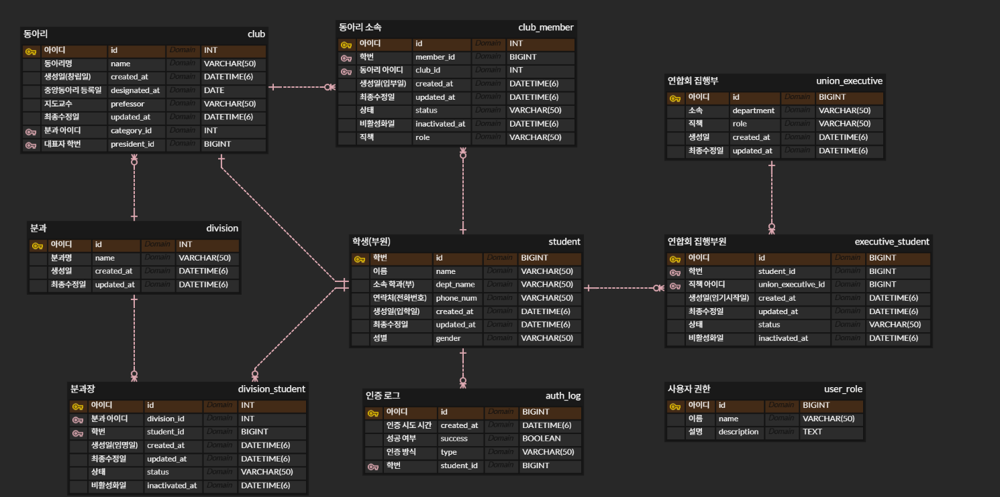

# ℹ️ DGU-Club Auth System

2025년 2학기 데이터베이스설계 기말 프로젝트

## 📚 문제 정의

현재 동국대학교의 재학생 인증은 동국패스 및 nDrims와 같은 공식 시스템을 통해 이뤄지고 있다. 그러나 중앙동아리 부원의 소속 인증을 위한 공식 시스템은 존재하지 않는다. 실제로 동아리 연합회가 주관하는 행사에서는 중앙동아리 소속 여부를 확인하기 위해 각 동아리의 카카오톡 단체 방 참여 여부나 단순 구두 확인에 의존하고 있다. 이러한 절차는 다음과 같은 문제점을 갖는다.

1. 위조 가능성

   - 카카오톡 단체방 참여는 누구나 임의로 추가할 수 있어 신뢰성이 부족하다.
   - 학생 본인의 학번, 이름 등 최소 정보만으로도 부원이라고 주장할 수 있어 보안성이 떨어진다.

2. 공식성 부족

   - 학교나 동아리 연합회에서 관리하는 공식 인증 체계가 아니므로 행정적 근거가 약하다.

3. 데이터 관리 부재
   - 중앙동아리의 구성원, 직책, 가입·탈퇴 이력 등 필요한 데이터를 중앙에서 관리하지 않아 통계, 감사, 행정 처리가 어렵다.

이러한 문제를 해결하기 위해 “중앙동아리 부원 인증 시스템”을 구축하고자 한다. 학생은 QR 코드 기반 인증 토큰을 발급받아 행사 및 행정 업무에서 공식적으로 본인을 증명할 수 있게 한다.

## 📝 요구사항 정리

1. 학생 정보 관리

   - 학생의 학번, 이름, 소속 학과, 연락처 등을 관리한다.
   - 재학생 인증을 위해 외부 인증 시스템(nDrims 등)과 연동될 수 있도록 식별 정보 기반 구조가 필요하다.

2. 중앙동아리 정보 관리

   - 중앙동아리 목록과 기본 정보를 저장한다.
   - 동아리의 지도교수, 분과, 동아리장 등의 정보를 기록한다.

3. 학생의 동아리 가입/탈퇴 관리

   - 학생은 여러 동아리에 가입할 수 있다.
   - 가입 승인 여부, 가입일자, 탈퇴일자, 직책 변경 이력을 관리해야 한다.

4. 동아리 임원 및 연합회 간부 관리

   - 동아리연합회 대의원으로서 동아리 내부 직책(회장, 부회장, 총무) 기록이 필요하다.
   - 연합회 임원 정보와 해당 임원이 어떤 학생인지 연결해야 한다.

5. 인증 기록 관리

   - 학생이 QR 코드 혹은 토큰을 통해 인증을 시도할 때마다 로그를 기록한다.
   - 성공 여부, 인증 시도 시각 등을 저장한다.

6. 역할 기반 접근 제어
   - 관리자(연합회), 동아리장, 일반 부원 등 사용자 권한을 구분해야 한다.
   - 이를 위해 user_role 테이블이 필요하다.

## 🗃️ ERD 설계



## ✨ 기대 효과

1. 부원 인증의 공식화

   - QR 코드 기반 인증을 통해 부원 여부를 중앙에서 공식적으로 증명할 수 있다.

2. 행정 효율성 향상

   - 동아리 분과별 통계, 가입 현황 조사 등 행정 업무가 자동화된다.

3. 보안 강화

   - 위조가 어려운 인증 체계가 마련되어 부정 참여를 방지할 수 있다.

4. 데이터 기반 의사결정 지원
   - 동아리 운영 현황, 참여율 등 데이터를 활용해 정책 개선이 가능하다.

## 🚀 구현된 기능

### 1. 학생 정보 관리 API

- `POST /api/students` - 학생 등록
- `GET /api/students` - 학생 목록 조회
- `GET /api/students/{id}` - 학생 단건 조회
- `DELETE /api/students/{id}` - 학생 삭제

### 2. 중앙동아리 정보 관리 API

- `POST /api/clubs` - 동아리 등록
- `GET /api/clubs` - 동아리 목록 조회
- `GET /api/clubs/{id}` - 동아리 단건 조회
- `PATCH /api/clubs/{id}/division` - 동아리 분과 변경
- `DELETE /api/clubs/{id}` - 동아리 삭제
- `POST /api/clubs/join` - 동아리 가입
- `PATCH /api/clubs/memberships/{membershipId}/inactivate` - 동아리 탈퇴

### 3. 분과 관리 API

- `POST /api/divisions` - 분과 등록
- `GET /api/divisions` - 분과 목록 조회
- `GET /api/divisions/{id}` - 분과 단건 조회
- `DELETE /api/divisions/{id}` - 분과 삭제

### 4. 집행부 관리 API

- `POST /api/executives` - 집행부 직책 등록
- `GET /api/executives` - 집행부 목록 조회
- `GET /api/executives/{id}` - 집행부 단건 조회
- `DELETE /api/executives/{id}` - 집행부 삭제
- `POST /api/executives/appoint` - 학생을 집행부에 임명
- `PATCH /api/executives/appointments/{appointmentId}/retire` - 집행부 임명 해제

### 5. QR 코드 인증 API

- `POST /api/auth/qr/generate` - QR 코드 생성 (JWT 토큰 기반)
- `POST /api/auth/qr/verify` - QR 코드 검증 및 인증 로그 기록

### 6. 인증 로그 조회 API

- `GET /api/auth-logs` - 전체 인증 로그 조회
- `GET /api/auth-logs/student/{studentId}` - 특정 학생의 인증 로그 조회

### 7. 보안 및 권한 관리

- Spring Security 기반 인증/인가
- CORS 설정 (프론트엔드 연동 준비)
- JWT 기반 QR 토큰 생성 및 검증
- 역할 기반 접근 제어 (RBAC) 구조

## 🛠️ 기술 스택

- **Backend**: Spring Boot 4.0.0, Java 21
- **Database**: MySQL + Spring Data JPA
- **Query**: QueryDSL
- **Security**: Spring Security, JWT (JJWT)
- **QR Code**: ZXing (Google)
- **Build Tool**: Gradle

## ⚙️ 환경 설정

### 필수 환경 변수

```bash
# 데이터베이스 연결
DB_URL=jdbc:mysql://localhost:3306/dgu_club_auth
DB_USER=your_username
DB_PW=your_password

# JWT 설정 (선택사항, 기본값 제공됨)
JWT_SECRET=your-secret-key-at-least-256-bits
JWT_EXPIRATION=300
```

### Windows에서 환경 변수 설정

```cmd
# 현재 세션에서만 유효
set DB_URL=jdbc:mysql://localhost:3306/dgu_club_auth
set DB_USER=root
set DB_PW=password

# 영구 설정 (새 터미널에서 유효)
setx DB_URL "jdbc:mysql://localhost:3306/dgu_club_auth"
setx DB_USER "root"
setx DB_PW "password"
```

## 📦 실행 방법

### 1. 프로젝트 빌드

```cmd
gradlew clean build
```

### 2. 애플리케이션 실행

```cmd
gradlew bootRun
```

또는

```cmd
java -jar build\libs\dgu-club-auth-system-0.0.1-SNAPSHOT.jar
```

### 3. API 테스트

서버 실행 후 `http://localhost:8080` 에서 API 테스트 가능

## 📝 API 사용 예시

### QR 코드 생성 예시

```json
POST /api/auth/qr/generate
Content-Type: application/json

{
  "studentId": 2021110000
}
```

**응답:**

```json
{
  "token": "eyJhbGciOiJIUzI1NiIs...",
  "qrCodeBase64": "iVBORw0KGgoAAAANSUhEUgAA...",
  "expiresIn": 300
}
```

### QR 코드 검증 예시

```json
POST /api/auth/qr/verify
Content-Type: application/json

{
  "token": "eyJhbGciOiJIUzI1NiIs..."
}
```

**응답:**

```json
{
  "success": true,
  "message": "인증에 성공했습니다.",
  "studentId": 2021110000,
  "studentName": "홍길동",
  "authLogId": 1
}
```
